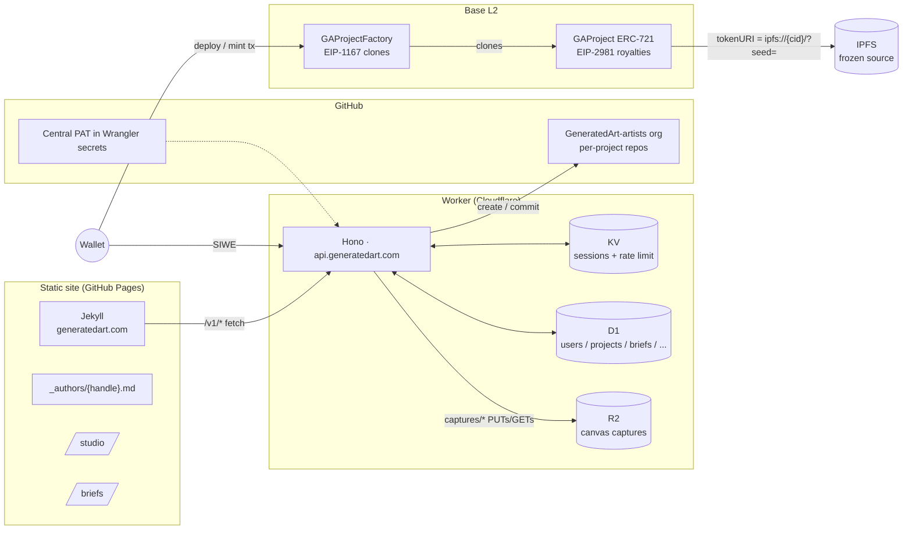

# GeneratedArt — Platform

> **Code-based generative art, owned by the people who write it.**
> A community-run platform and on-chain marketplace for hand-written p5.js,
> three.js, WebGL and GLSL. Spiritual successor to fxhash and Art Blocks,
> with a physical-digital bridge through the Geneva gallery.

- **Live demo:** https://generatedart.com
- **Demo Loom (90s):** _TODO — paste link before tagging `v0.1.0-hackathon`_
- **Demo mint on Basescan:** _TODO — paste tx URL once seed mint is recorded_
- **API health:** https://api.generatedart.com/health

## What's shipped (v0.1.0-hackathon)

| Surface          | Path              | Backed by                                  |
|------------------|-------------------|--------------------------------------------|
| Wallet sign-in   | `/connect/`       | Hono Worker + SIWE + KV sessions           |
| Repo-as-project  | `/dashboard/`     | GitHub PAT (central) + D1 `projects`       |
| Sketch Studio    | `/studio/`        | CodeMirror 6 + sandboxed p5 iframe + R2    |
| Profile + follow | `/@{handle}/`     | D1 `users` / `follows` + static `_authors` |
| Mint on Base     | `/mint/{id}`      | `GAProject` + `GAProjectFactory` (Base Sep.)|
| Briefs board     | `/briefs/`        | D1 `briefs` + KV rate limit                |

## Architecture



§2 of the platform brief in long form. Highlights:

- **One static target, one dynamic service.** GitHub Pages serves the
  Jekyll site; everything dynamic is one Hono Worker. No AWS, Vercel,
  Firebase, Supabase, Mongo, or Stripe-as-primary-rails.
- **Wallet does every transaction.** The Worker only returns calldata for
  `deploy` / `lockCID` / `mint` and verifies receipts; no platform key
  holds funds.
- **Source is the asset.** `tokenURI` resolves to a frozen IPFS CID that
  contains the exact repo state at mint time, plus a deterministic
  `?seed=` param.

## Layout

```
platform/
├── _config.yml, _layouts/, _includes/, _data/, _posts/    Jekyll site (root)
├── _authors/                                              /@{handle}/ static front-matter
├── briefs/, mint/, p/, studio/, dashboard/, @/            Surface pages (Jekyll)
├── assets/{css,js,img,images}/                            Brand CSS + bundled TS
├── workers/
│   └── api/         Hono Worker — auth, projects, profiles, mint, briefs
│       ├── src/     index.ts + auth/ + projects/ + users/ + briefs/ + db/ + lib/
│       ├── client/  Vanilla TS bundles (esbuild → assets/js/ga-*.js)
│       └── migrations/  D1 schema (0001..0006) + demo seed (0004)
├── contracts/       Foundry — GAProject, GAProjectFactory (Base L2)
├── CNAME            generatedart.com
└── .github/workflows/
    ├── pages.yml         Jekyll build + GitHub Pages deploy
    ├── worker-api.yml    Wrangler deploy → api.generatedart.com
    └── contracts.yml     forge build + test
```

## Quickstart

```bash
# 1. Static site (Jekyll, port 5000)
bundle install
bundle exec jekyll serve --host 0.0.0.0 --port 5000

# 2. API Worker (Hono, port 8787)
cd workers/api
npm install
npx wrangler d1 migrations apply DB --local   # one-time + after every new migration
npm run dev

# 3. Bundle changes
npm run build:all                              # rebuilds every assets/js/ga-*.js
```

The Replit `Start application` workflow runs the Jekyll command above.

## Deploy

| Surface         | Where             | How                                                   |
|-----------------|-------------------|-------------------------------------------------------|
| Static site     | GitHub Pages      | `pages.yml` on push to `main`                          |
| API Worker      | Cloudflare Workers| `worker-api.yml` on push to `workers/api/**`           |
| Contracts       | Base L2           | `forge script script/Deploy.s.sol --rpc-url base --broadcast` |

**Prod prerequisites** (one-time, before the first prod Worker deploy):

- `wrangler r2 bucket create generatedart-assets` (binding for canvas captures)
- `wrangler secret put JWT_SECRET --env production`
- `wrangler secret put GITHUB_PAT --env production`

## License

MIT for platform code. Artist bundles licensed individually (default
CC-BY-NC-4.0).
